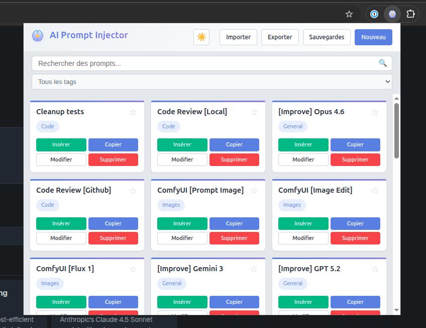
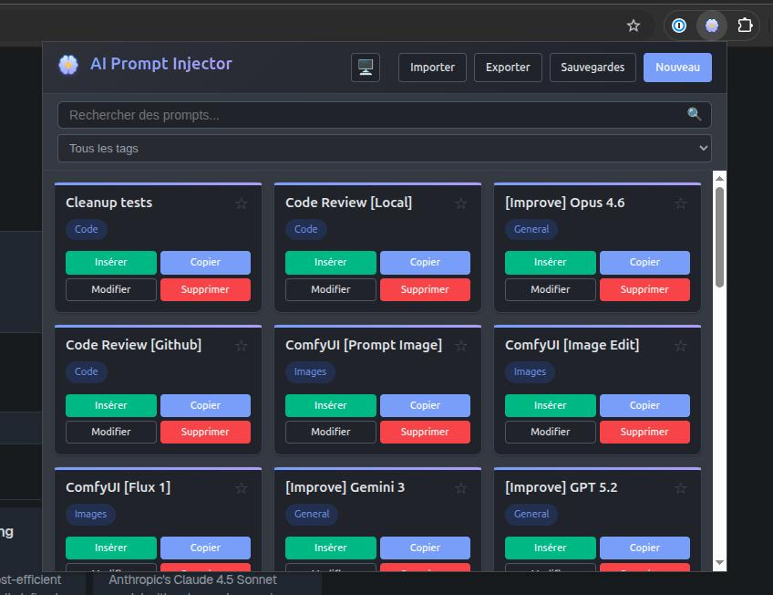

# AI Prompt Injector - Chrome Extension

Manage and insert prompts into any AI chat interface.




## Features

- **Prompt Management**: Create, edit, delete, and mark prompts as favorites
- **Tag System**: Organize prompts with tags; autocomplete with keyboard navigation
- **Real-time Search**: Filter prompts instantly by text or tag
- **Universal Injection**: Works on any website via on-demand script injection (`activeTab` + `scripting`)
  - 3-tier insertion: direct DOM → `execCommand('insertText')` → clipboard fallback (with warning)
- **Optimized selectors** for ChatGPT, Claude, Gemini, Mistral, DeepSeek, Grok, Qwen, Dust, NotebookLM, Google AI Studio — plus any site with a textarea or contenteditable field
- **Import/Export**: JSON format with flexible field mapping
- **Automatic Backups**: On browser startup, extension update, and before each import (max 3); restore from popup
- **i18n**: English and French
- **Theme Toggle**: Auto / Light / Dark
- **Accessibility** — `aria-label` on interactive elements, `aria-live` notifications, keyboard navigation
- **Privacy-first**: All data stored locally, zero tracking, no network requests

## Installation

### Chrome Web Store

Install from [Chrome Web Store](https://chromewebstore.google.com/detail/ai-prompt-injector/odjlacmnhpgdoifeeemjahbjpapnoccl).

### Manual (development)

1. Clone or download this project
2. Open Chrome and go to `chrome://extensions`
3. Enable "Developer mode" in the top right
4. Click "Load unpacked"
5. Select the project folder

## Usage

1. Click the extension icon in the toolbar
2. Create prompts with "New Prompt" and organize them with tags
3. Navigate to any AI chat page
4. Click "Insert" on a prompt to inject it into the chat input

## Project Structure

```
├── manifest.json          # Extension configuration (Manifest V3)
├── popup.html            # Popup UI
├── popup.css            # Styles with CSS custom properties and dark mode
├── popup.js             # PromptManager class — UI logic
├── storage.js           # PromptStorage class — CRUD, import/export, backups
├── content.js           # PromptInjector — DOM injection with domain selectors
├── background.js        # Auto-backup on startup and update
├── i18n.js              # Internationalization (en, fr)
├── icons/               # Extension icons (16–128px)
├── tests/               # Unit tests (Vitest + happy-dom)
├── vitest.config.js     # Test configuration
├── PRIVACY.md           # Privacy policy
├── TESTING.md           # Test documentation
└── LICENSE              # MIT
```

## Data Format

Prompts are stored as JSON:

```json
{
  "id": "prompt_1234567890_abc123def",
  "label": "Prompt title",
  "template": "Prompt content",
  "tags": ["tag1", "tag2"],
  "favorite": false,
  "createdAt": 1234567890
}
```

The import system accepts various JSON structures and field names.

## Permissions

| Permission   | Purpose                                              |
|--------------|------------------------------------------------------|
| `activeTab`  | Access the current tab only when the user clicks Insert |
| `storage`    | Store prompts and settings locally                   |
| `scripting`  | Inject the content script on demand                  |

No `host_permissions`. No `content_scripts`. No remote code.

## Development

No external runtime dependencies.

```bash
npm test              # Run tests in watch mode
npm run test:run      # Single test run
npm run test:coverage # Run with coverage report
```

To update DOM selectors for AI platforms, edit the `domainSelectors` object in `content.js`.

## Privacy

All data is stored locally in `chrome.storage.local`. The extension makes no network requests and collects no data. See [PRIVACY.md](PRIVACY.md) for details.

## License

[MIT](LICENSE)
